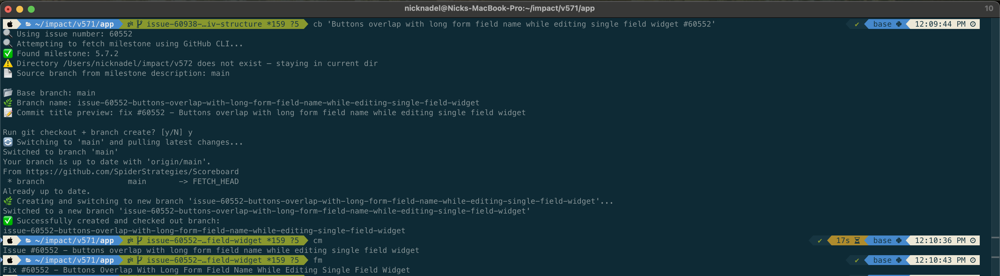

# 🕷️ Spider ZSH Utils

ZSH utilities for Spider Strategies developers to streamline Git workflow and branch naming conventions.




## Features

- 🧠 Auto-generates branch names like `issue-60938-field-widgets-have-a-span-with-a-nested-div-structure`
- 📌 Infers base branch from GitHub milestone (via `gh` CLI)
- 📁 Auto-cds into correct `~/impact/vXYZ` folder based on milestone
- 🧭 Falls back to current directory if milestone format or folder is missing
- 📝 Includes helpers for commit messages, issue IDs, and capitalization
- 🚀 One-liner PR creation with correct base branch and issue reference

## Requirements

- ZSH
- GitHub CLI (`gh`) — for milestone detection and PR creation (optional but recommended)
- `jq` — used to parse milestone data (optional but recommended)

> If `gh` or `jq` are not installed, the plugin will fall back to guessing the base branch from your current folder.

## Installation

### Option 1 – Direct paste into `.zshrc`

```zsh
source /path/to/spider-utils.plugin.zsh
```

### Option 2 – Oh My Zsh plugin (recommended)

```bash
git clone git@github.com:nicholasnadel/spider-zsh-utils.git \
  ${ZSH_CUSTOM:-~/.oh-my-zsh/custom}/plugins/spider-utils
```

Then add to your `.zshrc`:

```zsh
plugins=(... spider-utils)
```

Reload ZSH:

```zsh
source ~/.zshrc
```

## Usage

### Create branch

```zsh
cb "Field widgets have a span with a nested div structure #60938"
```

This will:

- Switch to the correct milestone base branch
- Change directory to the correct version folder (e.g., `~/impact/v571`)
- Create and checkout:

```bash
issue-60938-field-widgets-have-a-span-with-a-nested-div-structure
```

### Open pull request

After committing, run:

```zsh
pr
```

This will:

- Look up the milestone for the current branch's issue
- Use the proper base branch (`branch-here-release-X.Y.Z` or `main`)
- Prompt if the PR should close the issue
- Auto-generate a PR title like:

```
Issue #60938 - Field widgets have a span with a nested div structure
```

- And set the PR body to either:

```
Fixes #60938
```

or

```
Issue #60938
```

depending on your input.

### Aliases & Helpers

```zsh
id
# → Issue #60938

cm
# → issue #60938 - field widgets have a span with a nested div structure

fm
# → Fix #60938 - Field Widgets Have A Span With A Nested Div Structure

pr
# → Prompts and opens a pull request for the current branch
```
